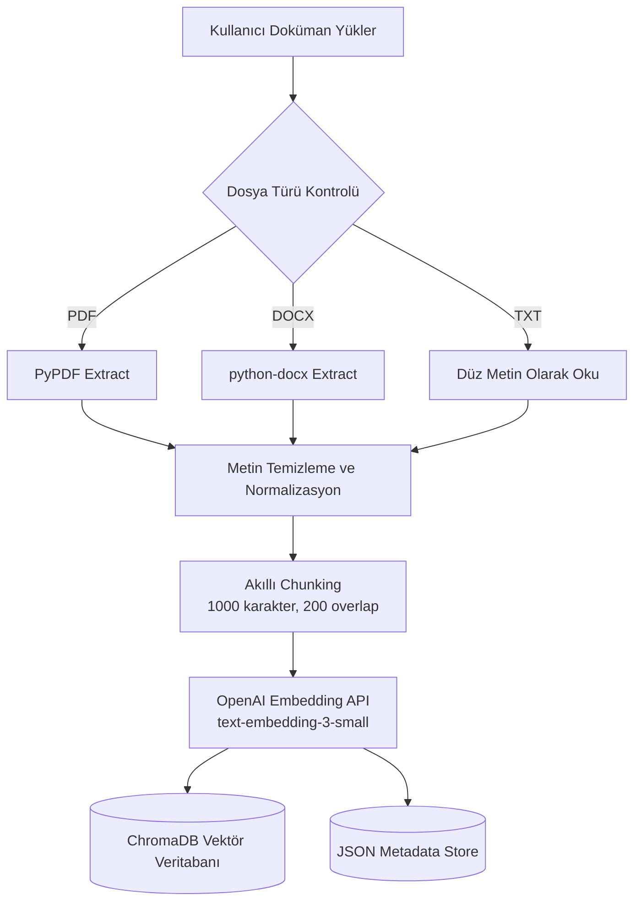
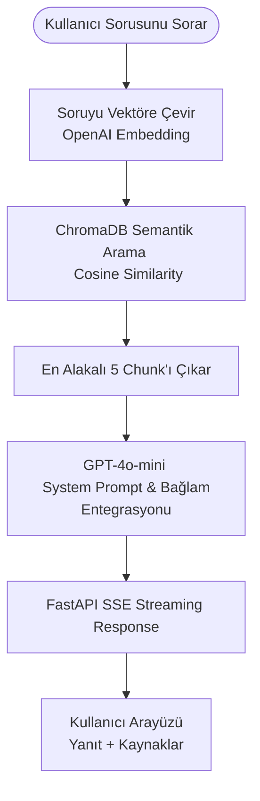

# 📄 DocuChat — Yapay Zekâ Destekli Akıllı Doküman Sohbet Sistemi (RAG)

[](https://fastapi.tiangolo.com/)
[](https://openai.com/)
[](https://www.trychroma.com/)
[](https://www.docker.com/)
[](https://www.python.org/)

**DocuChat**, kullanıcıların kendi dokümanlarını (PDF, DOCX, TXT) yükleyip, bu dokümanlar hakkında akıllı ve bağlamsal sorular sorabilmesini sağlayan uçtan uca bir **RAG (Retrieval-Augmented Generation)** uygulamasıdır. 

Modern, duyarlı (responsive) bir karanlık mod arayüzüne, Server-Sent Events (SSE) tabanlı gerçek zamanlı kelime akışına (streaming response) ve yapay zekânın verdiği cevapların doğruluğunu kanıtlayan detaylı kaynakça/benzerlik yüzdesi gösterimine sahiptir.

---

## 📸 Arayüz Görselleri

Projenin modern arayüzünü ve temel işlevlerini aşağıda inceleyebilirsiniz:

### 1. Ana Panel ve Sohbet Ekranı
Arayüz, modern karanlık teması, minimal çizgileri ve kullanıcı dostu yerleşimi ile profesyonel bir SaaS ürünü hissi sunar.


### 2. Çoklu Doküman Yönetimi ve Sürükle-Bırak Yükleme
Sol panelden çoklu dosya yükleyebilir, dilediğiniz dokümanları seçerek sorgulama kapsamınızı esnek bir şekilde belirleyebilirsiniz.


### 3. Gelişmiş RAG Yanıtı ve Akıllı Kaynakça Gösterimi
Yapay zekâ yanıtları kelime kelime akarken, hemen altında yanıtın dokümanın tam olarak hangi bölümünden alındığı ve benzerlik (uyum) yüzdesi şeffaf bir şekilde listelenir.


---

## 🏗️ Sistem Mimarisi ve RAG Akışı

DocuChat, veri güvenliğini ve doğruluğu en üst düzeye çıkaran optimize edilmiş iki ana boru hattından (pipeline) oluşur:

### 1. Doküman Veri Giriş Hattı (Ingestion Pipeline)


### 2. Akıllı Sorgu Hattı (Query & RAG Pipeline)


---

## ✨ Öne Çıkan Özellikler

- **Çoklu Format Desteği:** PDF, DOCX, DOC ve TXT dosyalarını mükemmel doğrulukta okur ve analiz eder.
- **Akıllı Metin Bölümleme (Chunking):** Anlam ve bağlam kaybını önlemek için 1000 karakterlik ve 200 karakter örtüşmeli (overlap) dinamik bölme algoritması kullanır.
- **Vektör Veritabanı (ChromaDB):** Dokümanlarınızı kalıcı (persistent) olarak saklar, çok hızlı cosine similarity aramaları gerçekleştirir.
- **Gerçek Zamanlı Cevap Akışı (Streaming):** Server-Sent Events (SSE) teknolojisi sayesinde yapay zekâ yanıtlarını bekletmeden, kelime kelime ekrana yazdırır.
- **Akıllı Kaynak Gösterimi:** Verilen her cevabın hangi dokümanın hangi kesitinden alındığını benzerlik skorlarıyla (% Uyum) birlikte gösterir.
- **Özetleme Modülü:** Seçili olan tek veya çoklu dokümanların ana fikirlerini tek tuşla özetler ve şık bir modal pencerede sunar.
- **Konteynerleştirilmiş Altyapı:** Docker ve Docker Compose ile tek komutla tüm bağımlılıkları barındıracak şekilde kurulup çalıştırılabilir.
- **Minimalist ve Modern UI:** Inter yazı tipi, cam morfizasyonu (glassmorphic) bileşenler, özel animasyonlar ve tamamen CSS değişkenleriyle tasarlanmış modern karanlık tema.

---

## 🛠️ Teknoloji Yığını (Tech Stack)

### Backend
- **Framework:** FastAPI (Asenkron, yüksek performanslı Python API web framework)
- **Vector DB:** ChromaDB (Hafif ve güçlü vektör depolama)
- **AI Integrations:** OpenAI SDK (GPT-4o-mini & text-embedding-3-small)
- **File Processors:** PyPDF2, python-docx
- **Settings:** Pydantic-Settings (Çevre değişkenleri yönetimi)

### Frontend
- **Structure & Logic:** HTML5 & Asenkron Vanilla JavaScript
- **Styling:** Vanilla CSS (Modern CSS Değişkenleri, Flexbox/Grid, Animasyonlar ve Responsive Tasarım)
- **Icons:** SVG formatında optimize edilmiş modern arayüz simgeleri

---

## 🚀 Kurulum ve Çalıştırma

### Hazırlık
Proje dizininde bir `.env` dosyası oluşturun ve **OpenAI API Anahtarınızı** tanımlayın (Projede hazır `.env` dosyası bulunmakta veya `.env.example` referans alınabilmektedir):
```env
OPENAI_API_KEY=sk-proj-xxxx...
CHAT_MODEL=gpt-4o-mini
EMBEDDING_MODEL=text-embedding-3-small
```

---

### Yöntem 1 — Docker ile Çalıştırma (Önerilen)

Docker Desktop uygulamasının açık olduğundan emin olun. Ardından projenin kök dizininde (`docuchat_final/docuchat`) şu komutu çalıştırın:

```bash
docker compose up --build
```

**Uygulama Adresleri:**
- 🖥️ **Arayüz (Frontend):** [http://localhost:8001](http://localhost:8001)
- 📄 **Interactive Swagger API Docs:** [http://localhost:8001/api/docs](http://localhost:8001/api/docs)

*(Not: Port çakışmalarını önlemek için dış port **8001** olarak yapılandırılmıştır).*

---

### Yöntem 2 — Manuel Olarak Çalıştırma (Geliştirme Ortamı)

Yerel makinenizde Python 3.10+ kurulu olması gerekmektedir.

1. **Sanal Ortam Oluşturun ve Aktifleştirin:**
   ```bash
   cd backend
   python -m venv venv
   
   # Windows için:
   .\venv\Scripts\activate
   # macOS/Linux için:
   source venv/bin/activate
   ```

2. **Bağımlılıkları Yükleyin:**
   ```bash
   pip install -r requirements.txt
   ```

3. **Uygulamayı Başlatın:**
   ```bash
   uvicorn app.main:app --reload --port 8000
   ```

4. **Kullanım:**
   Tarayıcınızdan doğrudan [http://localhost:8000](http://localhost:8000) adresine giderek uygulamayı kullanabilirsiniz. Backend, `/frontend` klasöründeki statik dosyaları otomatik olarak servis edecektir.

---

## 📡 API Uç Noktaları (Endpoints)

FastAPI otomatik olarak zengin ve interaktif bir dokümantasyon sağlar. Tüm uç noktaları ve şemaları detaylı incelemek için tarayıcınızdan `/api/docs` rotasını ziyaret edebilirsiniz.

| Metot | Uç Nokta | Açıklama |
| :--- | :--- | :--- |
| **GET** | `/api/health` | Backend servisinin sağlık durumunu doğrular |
| **POST** | `/api/documents/upload` | Tek seferde birden fazla doküman yükler, işler ve ChromaDB'ye yazar |
| **GET** | `/api/documents/` | Sisteme yüklenmiş tüm dokümanların listesini ve istatistiklerini getirir |
| **DELETE** | `/api/documents/{id}` | Dokümanı, metadata kayıtlarını ve ChromaDB'deki ilişkili tüm vektörleri siler |
| **POST** | `/api/chat/stream` | Soruyu RAG mimarisiyle işler ve kelime akışını (SSE) başlatır |
| **POST** | `/api/chat/summarize` | Seçili dokümanların yapay zekâ ile genel bir özetini çıkarır |

---

## 📂 Proje Dosya Yapısı

Proje, temiz kod (clean code) prensiplerine uygun, modüler ve geliştirilebilir bir yapıdadır:

```text
docuchat/
│
├── backend/
│   ├── app/
│   │   ├── main.py              # Uygulama başlatıcı, CORS ve Static File sunumu
│   │   ├── config.py            # Ortam değişkenleri ve konfigürasyon (Pydantic)
│   │   ├── models.py            # API İstek/Yanıt modelleri (Pydantic)
│   │   │
│   │   ├── routers/
│   │   │   ├── documents.py     # Yükleme, listeleme ve silme API uç noktaları
│   │   │   └── chat.py          # Sohbet akışı (streaming) ve özetleme API uç noktaları
│   │   │
│   │   └── services/
│   │       ├── document_processor.py  # Doküman okuma, temizleme ve chunking işlemleri
│   │       ├── vector_store.py        # ChromaDB bağlantısı, veri ekleme, arama ve silme
│   │       ├── llm_service.py         # OpenAI GPT-4o-mini akış ve özetleme çağrıları
│   │       └── metadata_store.py      # Yüklenen dosyaların genel bilgilerinin yönetimi
│   │
│   ├── Dockerfile
│   └── requirements.txt
│
├── frontend/
│   └── index.html               # Tek Sayfa Uygulama (SPA) arayüzü ve entegre CSS/JS
│
├── img/                         # GitHub portföyü için arayüz ekran görüntüleri
│   ├── Screenshot 1.png
│   ├── Screenshot 2.png
│   └── Screenshot 3.png
│
├── docker-compose.yml           # Çoklu servis orkestrasyon dosyası
├── .env.example                 # Çevre değişkenleri şablonu
└── README.md                    # Proje tanıtım ve kurulum dokümanı
```

---

## 🎯 Gelecek Yol Haritası

Projeyi daha da ileri götürmek için planlanan iyileştirmeler:
- [ ] **Kullanıcı Yetkilendirmesi (Auth):** JWT tabanlı kullanıcı oturumu ve her kullanıcının yalnızca kendi dokümanlarını görebilmesi.
- [ ] **Yerel LLM Desteği (Ollama):** OpenAI API yerine tamamen çevrimdışı çalışabilen Llama 3 veya Mistral desteği.
- [ ] **Semantik Önbellekleme (Semantic Cache):** Benzer sorular için tekrar OpenAI çağrısı yapmadan veritabanından hızlı cevap getirilmesi.
- [ ] **Genişletilmiş Dosya Desteği:** XLSX, PPTX, CSV ve Markdown formatlarının da veri giriş hattına entegrasyonu.
